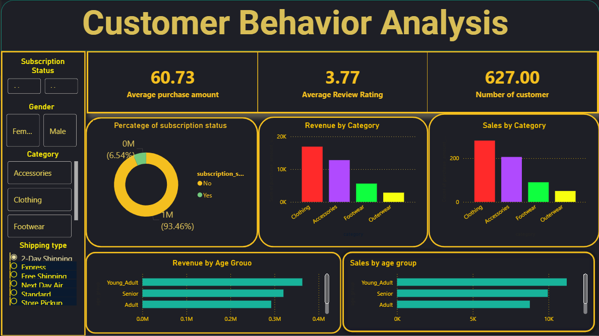

🌐 Customer Shopping Behavior Analysis – Premium Edition

A boardroom-ready, industry-grade analytical report engineered to decode real customer behavior patterns and drive revenue-centered decision-making.

🎬 Executive Summary

This project demonstrates your ability to:

Build a complete analytics pipeline

Develop Power BI dashboards

Extract actionable insights tied to KPIs

Perform segmentation & behavioral profiling

Deliver insights in an executive-ready format

🧭 Table of Contents

Executive Summary

Dashboard Preview

Project Objectives

Key Business Questions

Dataset Overview

Analytical Workflow

Insights & Interpretation

Business Recommendations

Repository Structure

Run Instructions

Case Study Summary

Author

License

📊 Dashboard Preview
✅ Your Dashboard (will display correctly with this line)

🎯 Project Objectives

This project solves core retail analytics challenges:

Identifying high-value customer groups

Profiling product category performance

Understanding subscription & shipping behavior

Linking satisfaction to revenue outcomes

Supporting data-driven business decisions

❓ Key Business Questions
Business Question	Metric Used	Purpose
Which category performs best?	Revenue, Sales Count	Inventory planning
Who spends more?	Avg Purchase	Demographic targeting
Are subscribers more profitable?	Revenue vs Subscription	Loyalty strategy
Which shipping type drives higher AOV?	Purchase Amount	Operational optimization
Do ratings correlate with revenue?	Review Ratings	Experience improvement
🧵 Dataset Overview
Feature	Description
Age Group	Young Adult, Adult, Senior
Gender	Male / Female
Purchase Amount	Customer spend
Category	Clothing, Accessories, Footwear, Outerwear
Subscription	Yes / No
Shipping Type	Standard, Express, Free Shipping
Review Rating	1–5 rating
🧪 Analytical Workflow
✔ Data Cleaning

Standardizing formats

Handling missing values

Ensuring data consistency

✔ Exploratory Data Analysis

Demographic segmentation

Revenue drivers

Frequency trends

✔ Visualization

Power BI dashboard

Python charts

✔ Insight Extraction

Behavioral patterns

Revenue correlations

Operational gaps

🔍 Insights & Interpretation
📌 1. Young Adults are the top revenue drivers

High repeat purchase behavior

📌 2. Clothing generates the most revenue

Category leader in both demand & margin

📌 3. Subscription adoption is very low

Large opportunity for loyalty expansion

📌 4. Express shipping attracts premium buyers

Higher AOV vs standard shipping

📌 5. Higher satisfaction = higher retention

Strong link to recurring revenue

💼 Business Recommendations
🔹 1. Launch Tiered Loyalty Program

Increase subscription conversions.

🔹 2. Optimize Inventory

Prioritize Clothing & Accessories.

🔹 3. Promote Express/Digital Shipping

Align with high-value shoppers.

🔹 4. Personalize Marketing Campaigns

Use demographic & behavioral segmentation.

🔹 5. Strengthen Review Strategy

Higher ratings → higher revenue.

📁 Repository Structure
Customer-Shopping-Behavior-Analysis/
│── data/
│── notebooks/
│   └── customer_behavior_analysis.ipynb
│── images/
│── README.md
│── Image.png

▶ Run Instructions
git clone https://github.com/Gauravsin522/Customer-Shopping-Behavior-Analysis
cd Customer-Shopping-Behavior-Analysis
pip install -r requirements.txt
jupyter notebook

🏆 Case Study Summary (Resume-Ready)

This project demonstrates expertise in:

Data cleaning & modeling

Customer behavior analytics

Dashboard storytelling

Business recommendation development

KPI-driven analysis

It showcases industry-ready analytical maturity.

👤 Author

Gaurav Singh
GitHub: https://github.com/Gauravsin522

LinkedIn: https://www.linkedin.com/in/gaurav-singh522/

📜 License

MIT License
